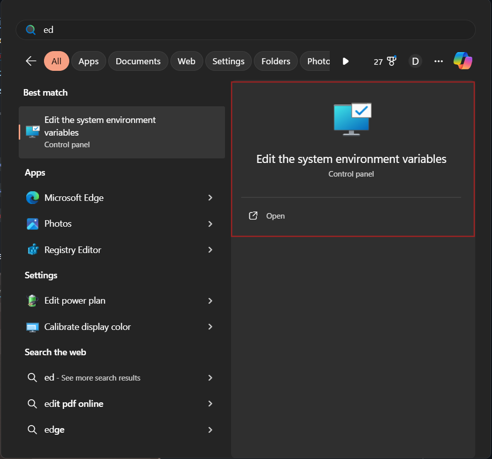

# 🐘 Installing Hadoop(3.3.4) on Windows: Step-by-Step Guide

## ⚠️ Before You Begin

To ensure a **smooth and error-free Hadoop installation** on Windows, it's highly recommended to **remove any previous Hadoop installations** before proceeding. This avoids conflicts, misconfigurations, and leftover environment variables from older setups.

---

### 📥 Required Downloads

Make sure you have the following files ready before starting the installation process. _(You can reuse previously downloaded files if they're intact.)_

| Tool                     | Description                          | Download Link                   |
| ------------------------ | ------------------------------------ | ------------------------------- |
| **JDK 1.8 (Update 361)** | Required for Hadoop runtime.         | [Download JDK 1.8_361][jdk]     |
| **WinRAR**               | Needed to extract `.tar.gz` files.   | [Download WinRAR][winrar]       |
| **Hadoop 3.3.4**         | Core Hadoop distribution.            | [Download Hadoop 3.3.4][hadoop] |
| **bin.zip**              | Contains `winutils.exe` for Windows. | [Download bin.zip][binzip]      |

- If you have any other decompression software alternative like [7-Zip](https://www.7-zip.org/download.html), etc. go ahead and use it.


<!-- Link definitions -->

[jdk]: https://drive.google.com/file/d/1MG3shs65Zpb-ZR_11GUM3WD7VSoGENfQ/view
[winrar]: https://www.win-rar.com/fileadmin/winrar-versions/winrar/winrar-x64-620.exe
[hadoop]: https://hadoop.apache.org/release/3.3.4.html
[binzip]: ./resources/bin.zip

## 🔧 Procedure

### ⚙️ Step 1: Install JDK 8
1. Run the downloaded installer:
   - File name: `jdk-8u361-windows-x64.exe`
   - Install using default options or custom path.


### 📦 Step 2: Extract Hadoop Archive to `C:\`

1. Locate the downloaded file `hadoop-3.3.4.tar.gz`

2. Use **WinRAR**, or any similar tool to extract the archive.

3. **Extract directly to the `C:\` drive** (not inside any subfolder like Downloads, Desktop, or Documents).

✅ After extraction, you should have the following folder:

<p align="left">
  
</p>

### 🧩 Step 3: Set Environment Variables
   <br/>
1. Type `"Edit the system environment variables"` in the Start Menu. 
   > 📝 Make sure it is not `"Edit Environment variables for your account"`

   - Windows 11 Preview - <br /> <p align="left"><br/></p>
   - Windows 10 Preview - <br /> <p align="left"><br/></p>

2. Locate both sections:
   - **User variables for `%YOUR_USERNAME%`**
   - **System variables**
      - preview
       <p align="left"><br/></p>
   - Now create two environment variables with the following values in the before mentioned places:
      - Variable 1:
         - Variable name		: `JAVA_HOME`
         - Variable value	: `C:\Program Files\Java\jdk1.8.0_361` or the path of your preferred version
      - Variable 2:
         - Variable name		: `HADOOP_HOME`
         - Variable value	: `C:\hadoop-3.3.4` 
   - It should look like this after completion
      <p align="left"><br/></p>

   - Now, under both the variable lists, open `Path` (either by double-clicking on it or select it and click `Edit`), add the following directories to the list and click on `OK`:
      -  `C:\Program Files\Java\jdk1.8.0_361\bin`
      -  `C:\hadoop-3.3.4\bin`
      -  `C:\hadoop-3.3.4\sbin`
   - It should look like this:
      - Preview: <br /> <p align="left"></p>

   - Click on `OK` again to close the environment variable window.


### 🗂️ Step 4: Add `winutils` Support for windows

To make Hadoop work properly on Windows, you need to add Windows-compatible binaries like `winutils.exe` to your Hadoop installation.

---
#### 🗃️ 1. Extract `bin.zip`
   - Locate the downloaded `bin.zip` file.
   - Use **WinRAR**, **7-Zip**, or any archive tool to extract it.
#### 📁 2. Paste `bin` into Hadoop Directory
   - Copy the **entire extracted `bin` folder**.
   - Paste it to `C:\hadoop-3.3.4`. Click on `✔️ Replace the files in the destination` when prompted.

### 🗂️ Step 5: Create Hadoop Data Directories
- Create a new folder in the following locations:
  - `data` in `C:\hadoop-3.3.4`
  - `namenode` in `C:\hadoop-3.3.4\data`
  - `datanode` in `C:\hadoop-3.3.4\data`

### 📝 Step 6: Configure `core-site.xml`
To configure the default file system path for Hadoop, you need to edit the `core-site.xml` file.

---
#### 1. Open the File `C:\hadoop-3.3.4\etc\hadoop\core-site.xml`
> Open the file with **Notepad** or **VSCode**

#### 2. Paste the configuration

```xml
<configuration>

   <property>
       <name>fs.defaultFS</name>
       <value>hdfs://localhost:9000</value>
   </property>

</configuration>
```

### 📝 Step 7: Configure `core-site.xml`
The `mapred-site.xml` file is used to configure the **MapReduce execution framework**.

---
#### 1. Open the File `C:\hadoop-3.3.4\etc\hadoop\mapred-site.xml`
> Open the file with **Notepad** or **VSCode**

#### 2. Paste the configuration

```xml
<configuration>

    <property>
        <name>mapreduce.framework.name</name>
        <value>yarn</value>
    </property>
 
 </configuration>
```

### 🗃️ Step 8: Configure `hdfs-site.xml`

The `hdfs-site.xml` file is used to configure settings related to the Hadoop Distributed File System (HDFS), such as replication and storage paths.

---
#### 1. Open the File `C:\hadoop-3.3.4\etc\hadoop\hdfs-site.xml`
> Open the file with **Notepad** or **VSCode**

#### 2. Paste the configuration

```xml
<configuration>

    <property>
        <name>dfs.replication</name>
        <value>1</value>
    </property>
 
    <property>
        <name>dfs.namenode.name.dir</name>
        <value>/hadoop-3.3.4/data/namenode</value>
    </property>
 
    <property>
        <name>dfs.datanode.data.dir</name>
        <value>/hadoop-3.3.4/data/datanode</value>
    </property>
 
 </configuration>
```

### 🔁 Step 9: Configure `yarn-site.xml`

The `yarn-site.xml` file contains configuration settings for **YARN** (Yet Another Resource Negotiator), which manages resource allocation in Hadoop.

---
#### 1. Open the File `C:\hadoop-3.3.4\etc\hadoop\hdfs-site.xml`
> Open the file with **Notepad** or **VSCode**

#### 2. Paste the configuration
```xml
   <configuration>

   <property>
        <name>yarn.nodemanager.aux-services</name>
        <value>mapreduce_shuffle</value>
   </property>

   <property>
        <name>yarn.nodemanager.auxservices.mapreduce.shuffle.class</name> 
        <value>org.apache.hadoop.mapred.ShuffleHandler</value>
   </property>

</configuration>
```

### 🧾 Step 10: Configure `hadoop-env.cmd`
This step ensures that Hadoop knows the correct path to your installed JDK and resolves user-related path issues on systems with spaces in usernames.

---
#### 1. Open the File `C:\hadoop-3.3.4\etc\hadoop\hadoop-env.cmd`
> Open the file with **Notepad** or **VSCode**

#### 2. Make the following changes
> Find your system username by running `whoami` or `echo %USERNAME%` (Windows) in the terminal.
  - Find `set JAVA_HOME=%JAVA_HOME%`
  - Replace it with `set JAVA_HOME=C:\Progra~1\Java\jdk1.8.0_361`
    - *Note:* You just have to replace the `%JAVA_HOME%` with the path specified above or the path to your preferred version. I gave it in full for easy searching.
  - *Mandatory:* For systems with usernames containing white-space (Ex: Hari Krishna) & ignore for those who don't:
    - Find `set HADOOP_IDENT_STRING=%USERNAME%`
    - Replace it with your `User` path but with the last letter of your username's first word replaced with `~1`. Example: `Hari Krishna` -> `Har~1`
      - Like `set HADOOP_IDENT_STRING=C:\User\Har~1` 
  - Save and close the editor

---
---

### ✅ Step 11: Verify Your Hadoop Installation

To confirm everything is set up correctly, follow these verification steps:

---

#### 🖥️ 1. Open Command Prompt

- Press `Win + S`, type `cmd`
- **Right-click** on **Command Prompt** and select **"Run as administrator"**

> ⚠️ Running as admin helps avoid permission issues during Hadoop startup.

- Preview <br/>

   <p align="left"></p>

---

- Run the command `hdfs` it should output like the one below:
  - Preview: <br /> 
      <p align="left"></p>
  - If there is an `Error: JAVA_HOME is incorrectly set` message just after you run the command, you might have INCORRECTLY set the `Environment variable` or `Path` or `hadoop-env.cmd` steps. Go back and verify.

- Format namenode:
  - Run the command `hdfs namenode -format`
  - The output should be like in the following - [Link](./cmdOutput/namenodeFormatsuccess.txt)
  - Preview: <br /> 

      <p align="left"></p>


- Run the cluster
  - Execute the command `start-all.cmd` in the command prompt (CMD)
  - You should now get the following command prompt windows running:
    - Apache Hadoop Distribution - hadoop namenode
    - Apache Hadoop Distribution - hadoop datanode
    - Apache Hadoop Distribution - yarn resourcemanager
    - Apache Hadoop Distribution - yam nodemanager
  - You may get the following window during first-time use:
    - Preview (Reference): <br /> <p align="left"></p>
    - Tick both `Private networks...` and `Public networks...` and click on `Allow access`
  - Give it a few moments to initialize.
  - Preview
       <br /> <p align="left"></p>
  
---
### Accessing the UI:

- If all the things done till now are verified, you may attempt to access the UI.
- Open your preferred browser and enter the following address:
  - For accessing ResourceManager web UI: http://localhost:8088
    - Preview: <br /> <p align="left"></p>
  - For accessing NameNode web UI: http://localhost:9870
    - Preview: <br /> <p align="left"></p>


## 🛑 Stop Hadoop
```cmd
stop-all.cmd
```
